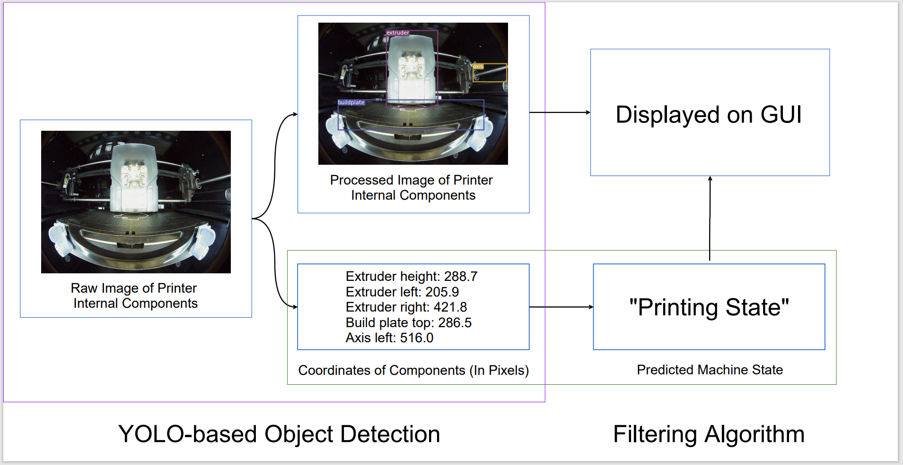

# Project Smart Connected Worker (SCW) - Module 1: 
## A YOLO-based Automated System for Real-time 3D Printer State Monitoring
This is the object detection module for the [Smart Connect Worker project](https://github.com/BrandonBian/SCW-V1.0) funded and supervised by California State University Northridge Department of Energy.
This is the Python implementation regarding the YOLO-based object detection model as well as the machine state filtering algorithm as proposed in the published [ICCS 2021 conference paper](https://link.springer.com/chapter/10.1007%2F978-3-030-77970-2_42) by Bian et. al. 
This work is largely based on the object detection model of [YOLOv3](https://github.com/eriklindernoren/PyTorch-YOLOv3).

## Summary (Detailed methodology is in the paper)

The proposed work consists of two main parts: the first part is a YOLO-based object detection model that is able to detect and output the relative coordinates of the major components of a 3D printer; the second part is a filtering algorithm that takes as the input the coordinates predicted by the first module, and filters out the current machine state from all possible machine states by analyzing the coordinates. Finally, the raw and processed images as well as the predictions are displayed on a web-based graphical user interface (which is not included in this repository). All modules function in real-time, which allows spontaneous detections and monitoring of machine states.

The following GIF shows a real-time demonstration of 3D printer monitoring:


## Part 1: YOLO-based object detection
We pre-trained a YOLOv3 model using images collected during an experiment in which the 3D printer of interest printed a sample model. During real-time testing, raw images acquired from a camera located inside the 3D printer are fed into the pre-trained model, which produces the processed images with bounding boxes around each major component, as well as the coordinates of the detected components in pixels.

## Part 2: Filtering algorithm
Most 3D printers have to go through a certain series of machine states in order to print a model. We investigate the characteristics of these machine states by analyzing the positions and movement patterns of each major printer interior component. The filtering algorithm is able to extract useful information from the outputs of the YOLO-based object detection module, and predict the machine state.

## File Descriptions
models.py: the YOLOv3 object detection model

obj.names: the components that we are analyzing (and fed into the training of the model)

object_detection_test.py: a naive demonstrating Python program that illustrates the workflow of the YOLO object detection model and the filtering algorithm

yolov3-custom.cfg: a configuration file for the training and testing of the model

Note: You may download the pre-trained weight [here](https://drive.google.com/file/d/1h2eFIRpB2K5esNt6qKxO1HiZ8V7e3kFm/view?usp=sharing), and put it into a folder named "weights". **Update**: there is a better pre-trained weight [here](https://drive.google.com/file/d/1XrfeUAppVzBK4A6DT92UttHZoljDv3Ft/view?usp=sharing) that was trained for a subsequent journal paper, and under more complicated dataset.

## Conclusion
This is only a naive model of the work proposed in the paper and is only for reference. We believe this work demonstrates the feasibility and efficiency of adopting machine learning algorithms to improve existing manufacturing systems.

## Other Information

If you find this project to be useful, please consider citing [our paper](https://link.springer.com/chapter/10.1007%2F978-3-030-77970-2_42):

```
@incollection{Bian_2021,
	doi = {10.1007/978-3-030-77970-2_42},
	url = {https://doi.org/10.1007%2F978-3-030-77970-2_42},
	year = 2021,
	publisher = {Springer International Publishing},
	pages = {554--567},
	author = {Shijie Bian and Tiancheng Lin and Chen Li and Yongwei Fu and Mengrui Jiang and Tongzi Wu and Xiyi Hang and Bingbing Li},
	title = {Real-Time Object Detection for Smart Connected Worker in 3D Printing},
	booktitle = {Computational Science {\textendash} {ICCS} 2021}
} 
```
